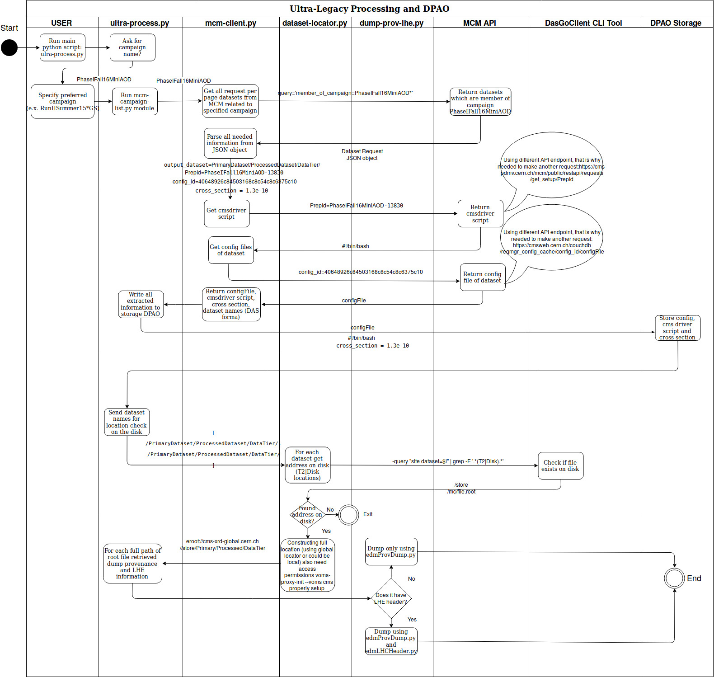

# Ultra-Legacy Production Scripts
Repository for extracting provenance information from specified campaign.

### Prerequisite and Basic Information
* Clone repository: `git clone -b ultra-legacy-production
  https://github.com/mantasavas/data-curation.git`
* Tested with `Python 2.7.5` on `lxplus.cern.ch`
* Before executing any of the scripts provided in this repository, please enable cms
environment by typing: `cmsenv`.
* Enable voms proxy by typing: `voms-proxy-init --voms cms --rfc --valid 190:00`
* Needs `click` Python library, for example do: `source
  ~simko/public/reana/bin/activate` to get nice Python environment with all
  dependencies set up. You also need to set `export LANG=en_US.utf8` for click
  to know which language to communicate in.
* For most actions you will NEED to have a valid CERN SSO cookie
* Public APIs do not require a cookie. Index of public API: https://cms-pdmv.cern.ch/mcm/public/restapi/
* Link to McM: https://cms-pdmv.cern.ch/mcm/
* McM Rest API: https://cms-pdmv.cern.ch/mcm/restapi

### Diagram representing algorithm worklow
* Found diagram hard to read? Feel free to edit and update, this will save someones time reading actual code.
* You can edit diagram on https://www.draw.io/, by importing final-ultra.xml
  file under diagram directory.

### Things so far implemented
* Extracting cmsdriver scripts, configuration files, cross section information
  from MCM.
* Locating datasets on disk via global locator and dumping provenance
  information.
